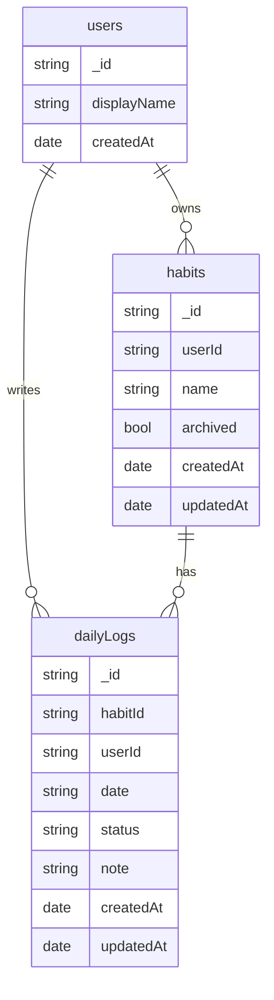

### Stage 1 — Data Model (MongoDB)

هدف: مدل ساده و قابل توسعه برای کاربران، عادت‌ها و لاگ‌های روزانه.

#### Collections
- `users`
  - `_id`
  - `displayName`
  - `createdAt`

- `habits`
  - `_id`
  - `userId` (ref users)
  - `name`
  - `archived` (bool)
  - `createdAt`, `updatedAt`

- `dailyLogs`
  - `_id`
  - `habitId` (ref habits)
  - `userId` (denormalized for easy queries)
  - `date` (ISO string YYYY-MM-DD in user timezone)
  - `status` ("done" | "skipped" | "none")
  - `note` (optional)
  - `createdAt`, `updatedAt`

#### ER (Mermaid)

#### Indexes (initial)
- `habits`: `{ userId: 1, archived: 1 }`
- `dailyLogs`: `{ userId: 1, date: 1 }`, `{ habitId: 1, date: 1 }`, unique compound `{ habitId: 1, date: 1 }` برای جلوگیری از ثبت تکراری

#### Timezone Strategy
- ذخیره `date` به صورت `YYYY-MM-DD` بر اساس timezone کاربر در سمت کلاینت
- نگهداری `createdAt/updatedAt` به UTC

#### Notes
- denormalization: نگه داشتن `userId` در `dailyLogs` برای کوئری سریع داشبورد

